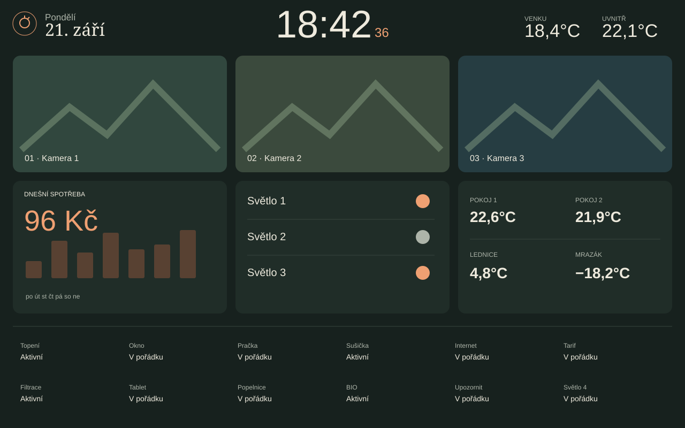

# Kitchen Atlas — tabletový dashboard pro Home Assistant

Vlastní trvale tmavý dashboard určený pro tablet položený na šířku. Hlavní pohled vykresluje lokální Web Component bez skládání běžných Lovelace karet.



## Co obsahuje

- hodiny se sekundami, datum a vnitřní i venkovní teplotu
- tři kamery, tři světla, spotřeby, teploty a stav domácnosti
- tři kuchyňské minutky běžící v Home Assistantu
- zvuk alarmu přímo na tabletu a volitelné mobilní notifikace
- vlastní modal s důvody pro rychlé upozornění
- tři pohledy: Tablet, Topení a Kamera

## Instalace

1. Zkopírujte `www/kitchen-atlas.js` do `/config/www/tablet-atlas/kitchen-atlas.js`.
2. V Nastavení → Nástěnky → Zdroje přidejte `/local/tablet-atlas/kitchen-atlas.js?v=1` jako JavaScript Module.
3. Podle [docs/ENTITIES.md](docs/ENTITIES.md) nahraďte všechna `example_*` ID v YAML i JavaScriptu vlastními entitami.
4. Vytvořte YAML dashboard a do editoru nezpracované konfigurace vložte `dashboard/dashboard-tablet.yaml`.
5. Chcete-li minutky, zkopírujte `packages/tablet_minutka.yaml` do adresáře balíčků, povolte packages v `configuration.yaml`, změňte služby `notify.mobile_app_phone_1` a `notify.mobile_app_phone_2`, zkontrolujte konfiguraci a restartujte HA.
6. Pro modal Upozornit změňte v `www/kitchen-atlas.js` zástupnou službu `mobile_app_phone_1`.
7. Po změnách obnovte stránku; při další aktualizaci JS zvyšte parametr `?v=`.

```yaml
homeassistant:
  packages: !include_dir_named packages
```

Pohled Topení používá [multiple-entity-row](https://github.com/benct/lovelace-multiple-entity-row) a [card-mod](https://github.com/thomasloven/lovelace-card-mod). Pro režim celé obrazovky lze použít [kiosk-mode](https://github.com/NemesisRE/kiosk-mode) a k vlastní cestě dashboardu přidat `?kiosk`.

Ukázkové obrázky obsahují pouze smyšlené hodnoty a grafiku. Repozitář neobsahuje lokální adresy, živé kamery, uživatelská ID, cíle notifikací, tokeny, hesla ani zálohy Home Assistantu.

## Licence

MIT — viz [LICENSE](LICENSE).
