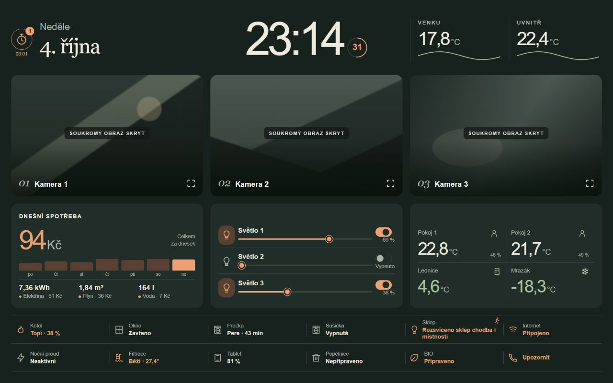
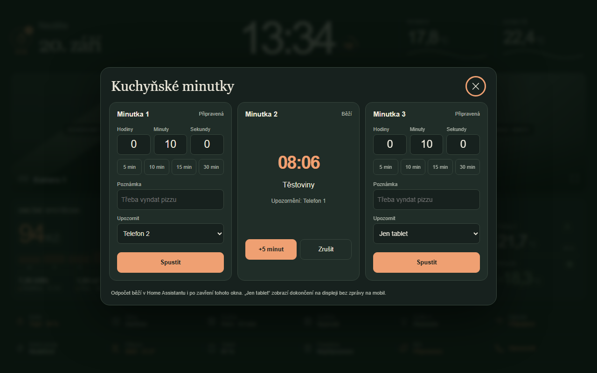
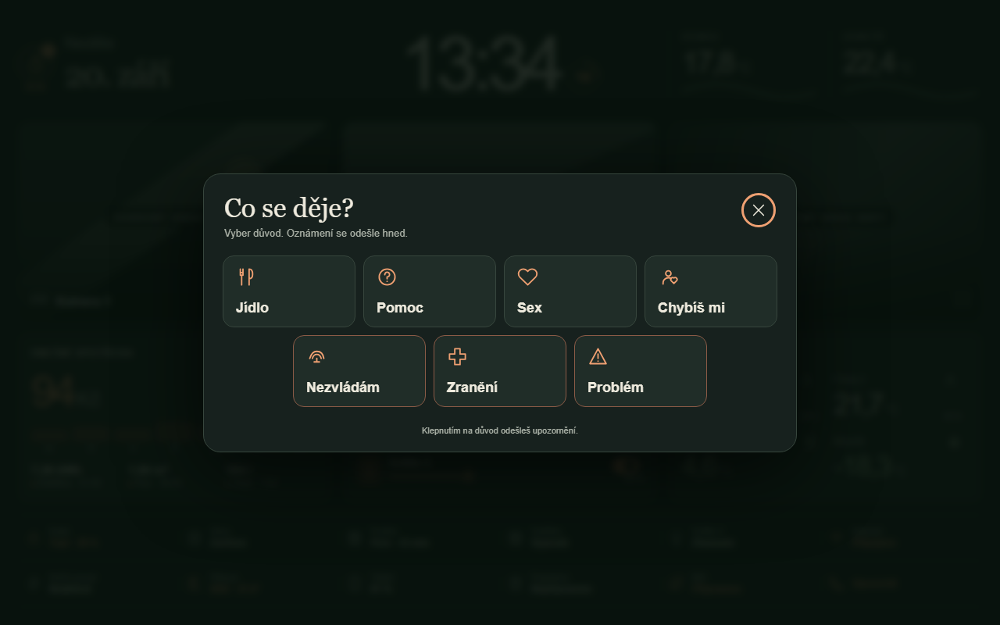
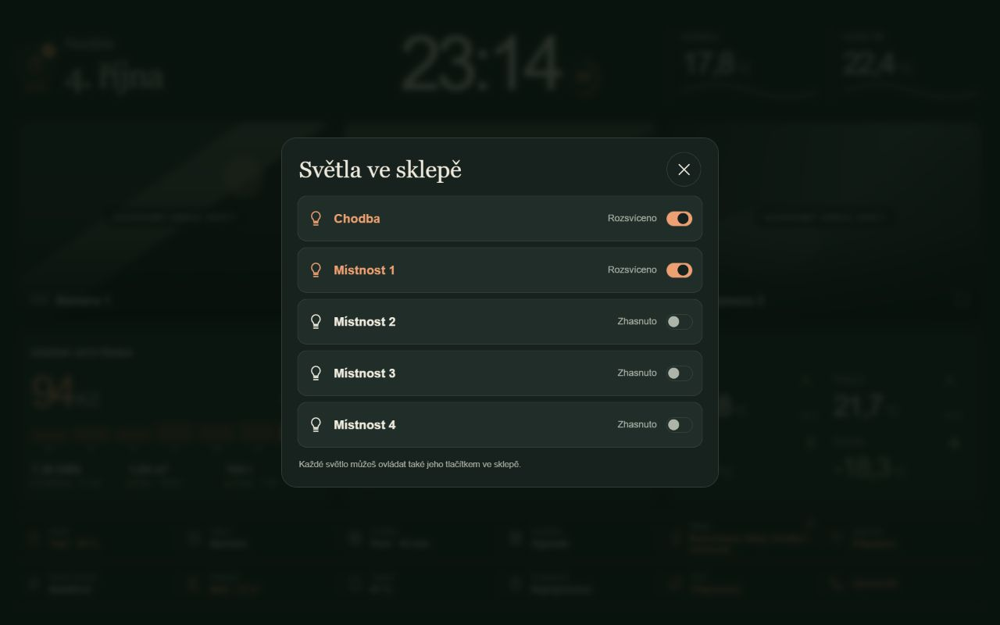

# Kitchen Atlas — Home Assistant tablet dashboard

A custom, permanently dark Home Assistant dashboard designed for a landscape kitchen tablet. It uses one local Web Component instead of a grid of standard Lovelace cards.



## Highlights

- responsive landscape layout tested at 960 × 600 and 1280 × 800 CSS pixels
- clock with seconds, date, indoor/outdoor temperature and seven-day cost chart
- three live camera areas, dimmable lights, appliance and household states
- three server-side kitchen timers with notes, phone targets and a tablet alarm
- custom notification-reason modal
- no cloud assets, web fonts, tracking code or bundled credentials




## Repository contents

- `dashboard/dashboard-tablet.yaml` — anonymized single-view Lovelace dashboard
- `www/kitchen-atlas.js` — the custom dashboard component
- `packages/tablet_minutka.yaml` — optional timer helpers, script and automation
- `docs/ENTITIES.md` — entity mapping and expected states
- `docs/*.png` — previews rendered directly from the component with anonymized cameras and demo data

## Install

1. Copy `www/kitchen-atlas.js` to `/config/www/tablet-atlas/kitchen-atlas.js`.
2. Add `/local/tablet-atlas/kitchen-atlas.js?v=1` as a **JavaScript Module** under Settings → Dashboards → Resources.
3. Replace every `example_*` entity in both the YAML and JavaScript. See [the entity map](docs/ENTITIES.md).
4. Create a YAML-mode dashboard and paste `dashboard/dashboard-tablet.yaml` into its raw configuration editor.
5. For the timers, copy `packages/tablet_minutka.yaml` into your packages directory, enable packages in `configuration.yaml`, edit the two placeholder `notify.mobile_app_phone_*` services, validate configuration and restart Home Assistant.
6. In `www/kitchen-atlas.js`, replace `mobile_app_phone_1` with the notification service used by the alert modal.
7. Reload the tablet page. Increment the `?v=` resource parameter after later JavaScript updates.

Example packages configuration:

```yaml
homeassistant:
  packages: !include_dir_named packages
```


## Privacy and safety

The previews show the component's actual layout and dialogs with demo values; camera images are replaced by privacy masks. The repository contains no dashboard backups, live camera frames, LAN addresses, user IDs, notification targets, tokens or credentials. Review your own fork before publishing it because replacing placeholders can introduce private data.

The alert choices are intentionally easy to customize in `CALL_REASONS`. A tap sends immediately; there is no second confirmation.

## Language and customization

The UI is Czech and the currency is CZK. Labels and entities are grouped near the top of `kitchen-atlas.js`. Date and time follow the Home Assistant time zone. The layout adapts to tablets and phones in portrait and landscape.

Český návod je hlavní [README.md](README.md).

## License

MIT — see [LICENSE](LICENSE).

## Version 1.1

- Cellar tile aggregates a hall and four room lights, shows a permanent motion icon that changes color, and opens five independent controls.
- Heating tile opens the main thermostat with automatic temperature updates after a short pause, heat/off controls and native HA temperature/burner modulation history (0–100%) for 24 hours or 7 days.
- Optional `packages/cellar_lights.yaml` sends per-room actionable notifications after one continuous hour on. YES turns off that room; NO leaves it on. Hall excluded. Configure placeholder entities and the phone service, enable packages, validate and restart HA. On iOS hold the notification to reveal actions. Restart/reload resets pending timers and action waits.
- Map `HEATING_ENTITY`, `CELLAR_LIGHTS` and `CELLAR_MOTION` to your own devices.



The dashboard contains only the main page. Separate Heating and Camera tabs were removed; their controls are available in main-page dialogs.

## Version 1.2

Portrait phones stack panels vertically and cameras scroll horizontally. Touch controls and dialogs adapt to small screens. Browser verified at 393, 852 and 960 CSS pixel widths.
