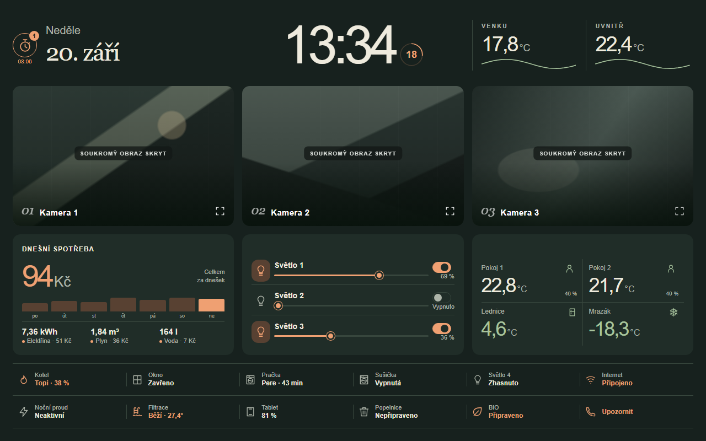

# Kitchen Atlas — tabletový dashboard pro Home Assistant

Vlastní trvale tmavý dashboard určený pro tablet položený na šířku. Hlavní pohled vykresluje lokální Web Component bez skládání běžných Lovelace karet.

[English version](README.en.md)



## Co obsahuje

- hodiny se sekundami, datum a vnitřní i venkovní teplotu
- tři kamery, tři světla, spotřeby, teploty a stav domácnosti
- tři kuchyňské minutky běžící v Home Assistantu
- zvuk alarmu přímo na tabletu a volitelné mobilní notifikace
- vlastní modal s důvody pro rychlé upozornění
- tři pohledy: Tablet, Topení a Kamera
- responzivní rozložení ověřené při 960 × 600 a 1280 × 800 CSS pixelech
- žádné cloudové prvky, webová písma, sledovací kód ani přibalené přihlašovací údaje


## Obsah repozitáře

- `dashboard/dashboard-tablet.yaml` — anonymizovaný Lovelace dashboard se třemi pohledy
- `www/kitchen-atlas.js` — vlastní komponenta dashboardu
- `packages/tablet_minutka.yaml` — volitelná konfigurace minutek, skript a automatizace
- `docs/ENTITIES.md` — mapa entit a očekávaných stavů
- `docs/*.png` — náhledy vyrenderované přímo z komponenty s anonymizovanými kamerami a ukázkovými údaji

## Instalace

1. Zkopírujte `www/kitchen-atlas.js` do `/config/www/tablet-atlas/kitchen-atlas.js`.
2. V Nastavení → Nástěnky → Zdroje přidejte `/local/tablet-atlas/kitchen-atlas.js?v=1` jako JavaScript Module.
3. Podle [docs/ENTITIES.md](docs/ENTITIES.md) nahraďte všechna `example_*` ID v YAML i JavaScriptu vlastními entitami.
4. Vytvořte YAML dashboard a do editoru nezpracované konfigurace vložte `dashboard/dashboard-tablet.yaml`.
5. Chcete-li minutky, zkopírujte `packages/tablet_minutka.yaml` do adresáře balíčků, povolte packages v `configuration.yaml`, změňte služby `notify.mobile_app_phone_1` a `notify.mobile_app_phone_2`, zkontrolujte konfiguraci a restartujte HA.
6. Pro modal Upozornit změňte v `www/kitchen-atlas.js` zástupnou službu `mobile_app_phone_1`.
7. Po změnách obnovte stránku; při další aktualizaci JS zvyšte parametr `?v=`.

```yaml
homeassistant:
  packages: !include_dir_named packages
```

Pohled Topení používá [multiple-entity-row](https://github.com/benct/lovelace-multiple-entity-row) a [card-mod](https://github.com/thomasloven/lovelace-card-mod). Hlavní pohled potřebuje pouze přiloženou komponentu a kamerový prvek Home Assistantu. Pro režim celé obrazovky lze použít [kiosk-mode](https://github.com/NemesisRE/kiosk-mode) a k vlastní cestě dashboardu přidat `?kiosk`.

## Soukromí a bezpečnost

Ukázkové obrázky zachycují skutečné rozložení a dialogy komponenty. Hodnoty jsou ukázkové a obraz kamer je nahrazen anonymní maskou. Repozitář neobsahuje lokální adresy, živé kamery, uživatelská ID, cíle notifikací, tokeny, hesla ani zálohy Home Assistantu.

Před zveřejněním vlastní upravené verze ji znovu zkontrolujte, protože dosazením skutečných entit můžete přidat soukromé údaje. Možnosti v upozorňovacím dialogu lze upravit v `CALL_REASONS`; klepnutí na důvod odešle zprávu ihned bez dalšího potvrzení.

## Jazyk a přizpůsobení

Rozhraní je v češtině a používá měnu CZK. Popisky a entity jsou soustředěné poblíž začátku souboru `www/kitchen-atlas.js`. Datum a čas respektují časovou zónu Home Assistantu. Návrh je určený pro tablet na šířku, nikoli pro úzké telefony na výšku.

## Licence

MIT — viz [LICENSE](LICENSE).
